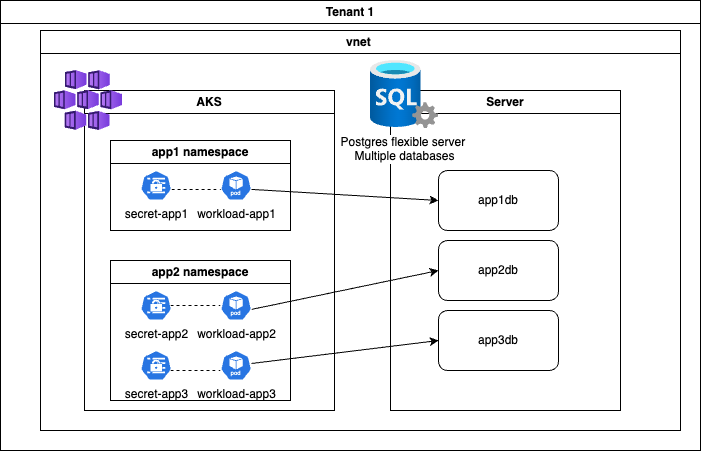

# Goal

A strategy for backing up the different databases of a flexible server used by AKS workloads.

## Context

The context is AKS workload using a flexible postrgres database on the same Vnet.
This flexible instance has a lot of databases used by different application on the same 
AKS or different AKS.

## Pain points 

The native backup solution provided by azure does not satify those requirements:
- Backup granulary each databases with different frequencies and retentions 
- Garantee immutability against ransomware  
- Provide a simple path to split and restore the databases on different tenants
- Capture the database and the AKS application as an atomic backup

## Proposal solution 

Use kasten to backup the AKS application and extends the backup of the database credential secret 
to lauch a pg_dump on the database. This dump will be included in the restore point created by Kasten. Kasten will be configured to create immutable backup, making the backup encrypted and ransomware proof. 

Because we're going to use the version-level immutability of azure blob container, even a rogue 
admin won't be able to destroy the backup if disaster recovery is enabled.

# Architecture 

## Prerequisite 

Having an AKS cluster or any kubernetes cluster on Azure that connect privately to 
a postgres flexible cluster and his read replica. 

How we build this on Azure is out of the scope of this guide.

### About database resolution 

Use the same private DNS zone in the Vnet so that you resolve the database the same way.
For instance in my lab the primary database resolve as rw.poc.postgres.database.azure.com
the read replica resolve as ro.poc.postgres.database.azure.com in both tenants.

## Backup 


Doing a pg_dump take a lot of resource on the database this is why we do it 
on the read replica and not directly on the primary database.

1. Kasten backup a secret which is having the credentials of the database
2. This secret is bound to a Kanister blueprint, Kasten lauch the Kanister blueprint
3. The blueprint launch a pod that will execute the blueprint commands
4. the pod do a pg_dump on the read replica
5. The database return the dump 
6. The pod send the dump on an storage account (where version-level immutability is enabled) as
a kopia snapshot, the kopia snapshot identifier is included in the Kasten restorepoint.

## Restore 


Restore can not be done on a read replica, but restore on production is always a rare event.

1. Kasten restore a secret which is having the credentials of the database
2. This secret is bound to a Kanister blueprint, Kasten lauch the Kanister blueprint
3. The blueprint launch a pod that will execute the blueprint commands
4. the pod retreive the kopia snapshot with the snapshot identifier in the restore point 
and the encryption key managed by Kasten 
5. A dump is returned to the pod 
6. The pod execute the dump to restore the database

## Restore on another tenant 


We import the restore point in kasten from the azure container first then we launch a restore. The 
process is the same. The import of the restore point is not shown in the diagram but this is 
accomplished with a classic migration policy.

The domain that point to the database will be the same in both tenant because we use a private DNS 
and for this reason we can use the same name. Hence no need to change the blueprint when the tenant 
change.

# Implementation 

## Prepare the databases 

We are going to create 3 databases with for each it's own user: app1, app2 and app3. 
Use your flexible credential to access the rw instance throug a pod
```
 az aks get-credentials --resource-group <your resource group> --name <your cluster name>
 kubectl create ns app1
 kubectl config set-context --current --namespace=app1
 kubectl run --image postgres:16.4 pg -- tail -f /dev/null
 kubectl exec -it pg -- bash 
 export PGHOST=rw.poc.postgres.database.azure.com
 export PGUSER=myadmin
 export PGPORT=5432
 export PGDATABASE=postgres
 export PGPASSWORD='<your admin password>'
 psql
```

Adapt `poc.postgres.database.azure.com` to your private dns zone.


Now that you are using the psql shell you can create 3 databases with the 3 administrators.
Let's do it for app1, app2 and app3. I show here for app1 

```
-- Create the database
CREATE DATABASE app1db;
-- Create the role without superuser privileges
CREATE ROLE app1 WITH LOGIN PASSWORD 'app1password';

-- Grant the role access to the specific database
GRANT ALL PRIVILEGES ON DATABASE app1db TO app1;
\c app1db
GRANT USAGE ON SCHEMA public TO app1;
GRANT CREATE ON SCHEMA public TO app1;
\q
```

Check you're able to connect as app1
```
export PGUSER=app1
export PGPASSWORD='app1password'
psql
```

Check the current user 
```
SELECT current_user;
```

You should obtain 
```
 current_user 
--------------
 app1
(1 row)
```
Redo this operation for app2 and app3.

## Create applications that work with the databases 

We are going to create two namespace app1 and app2, in app1 only one workload will work with app1db and in app2 two workload will work with app2db and app3db. 

Each of those workloads will use a secret to connect to their respective database.



```
kubectl create -f workloads.yaml
```

Those workloads are very simple and every 10s insert a new row with a timestamp in the example_table 
of each database.

## Install Kasten on both tenant 

[Installing kasten]() on AKS is out of the scope but for the need of this guide 
let's do it very quick. One your kube context point to your aks cluster just execute 
```
helm repo add kasten https://charts.kasten.io/
helm repo update
helm install k10 kasten/k10 --namespace=kasten-io --create-namespace
``` 

Checks all the pods are ready 
```
watch kubectl get po -n kasten-io
```

Once all the pods are ready open the UI
```
kubectl --namespace kasten-io port-forward service/gateway 8080:80
```
The dashboard will be available at http://127.0.0.1:8080/k10/#/

Go to location profile and create an [immutable azure profile](https://docs.kasten.io/latest/usage/configuration.html#azure-immutability-setup). 

> ***Note*** Use the same location profile for both tenant, an azure blob container is a object storage
> on the network (like s3) and can be accessed from another tenant or from your personal laptop.

## Install the blueprint and the blueprintbinding

### Secret management 
The blueprint will work with 2 secrets
- The databse secret app1, app2 or app3 which will provide information about the database name
and the user 
- The flexible-super-admin secret in the kasten-io namespace. This secret will be used during :
  - backup to create a dump of the database 
  - restore the database, recreate role and permission  

For each tenant create the appropriate flexible-super-admin secret in the kasten-io namespace

```
kubectl create secret generic flexible-super-admin  \
   -n kasten-io \
   --from-literal username=myadmin \
   --from-literal password='<super-admin password>'
```


### The blueprint binding 

The blueprint binding will bind the any secret that has the label `type: database-credential`
to the bluepring `flexible-bp`.
```
kubectl create -f flexible-bp-binding.yaml
```

### The blueprint 

```
kubectl create -f flexible-bp.yaml
```

You'll notice that the restore action recreate the authorization if the database 
does not exist yet.

# Backup, Restore, Migrate 

use kasten to backup, restore the secret asociated to each secret, the binding will make
sure that the blueprint will be executed for each secret. 


