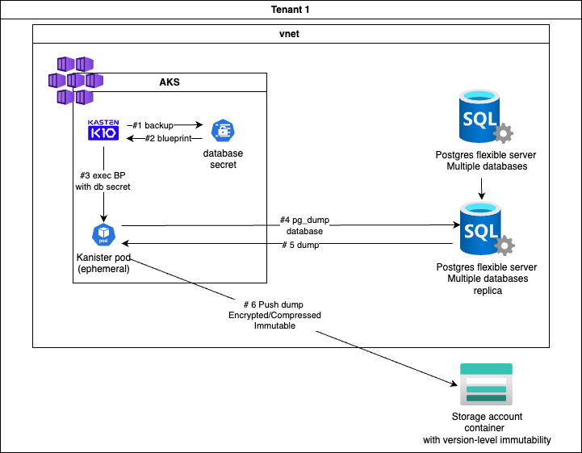
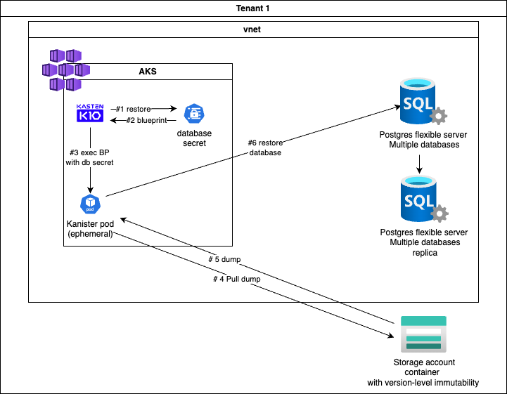
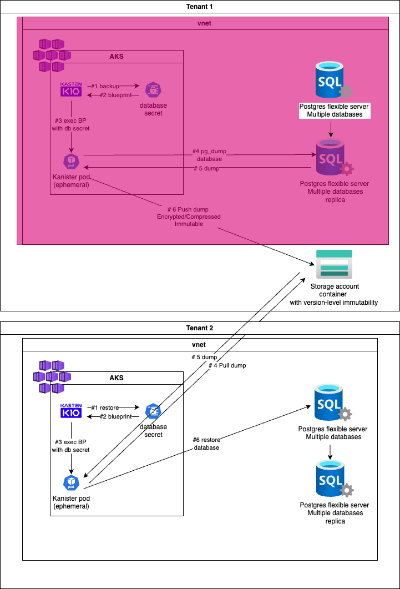

# Goal

A strategy for backing up the different databases of a flexible server used by AKS workloads.

## Context

The context is AKS workload using a flexible postrgres database on the same Vnet.
This flexible instance has a lot of databases used by different application on the same 
AKS or different AKS.

## Pain points 

The native backup solution provided by azure does not satify this requirements:
- Backup granulary each databases with different frequencies and retentions 
- Garantee immutability against ransomware  
- Provide a simple path to split and restore the databases on different tenants
- Capture the database and the AKS application as an atomic backup

## Proposal solution 

Use kasten to backup the AKS application and extends the backup of the databse credential secret 
to lauch a pg_dump on the database. This dump will be included in the restore point created by Kasten. Kasten will be configured to create immutable backup, making the backup encrypted and ransomware proof. 

Because we're going to use the version-level immutability of azure blob container. Even a rogue 
admin won't be able to destroy the backup if disaster recovery is enabled.

# Architecture 

## Prequisite 

Having an AKS cluster or any kubernetes cluster on Azure that connect privately to 
a postgres flexible cluster and his read replica. 

How we build this on Azure is out of the scope of this guide.

## Backup 



Doing a pg_dump take a lot of resource on the database this is why we do it 
on the read replica and not directly on the primary database.

1. Kasten backup a secret which is having the credentials of the database
2. This secret is bound to a Kanister blueprint, Kasten lauch the Kanister blueprint
3. The blueprint launch a pod that will execute the blueprint commands
4. the pod do a pg_dump on the read replica
5. The database return the dump 
6. The pod send the dump on an storage account where version-level immutability is enabled as
a kopia snapshot, the kopia snapshot identifier is included in the Kasten restorepoint.

## Restore 



Restore can not be done on a read replica, but restore on production is always a rare event.

1. Kasten restore a secret which is having the credentials of the database
2. This secret is bound to a Kanister blueprint, Kasten lauch the Kanister blueprint
3. The blueprint launch a pod that will execute the blueprint commands
4. the pod retreive the kopia snapshot with the snapshot identifier in the restore point 
and the encryption key managed by Kasten 
5. A dump is returned to the pod 
6. The pod execute the dump to restore the database

## Restore on another tenant 



We import the restore point in kasten from the azure container first then we launch a restore. The 
process is the same. 

The domain that point to the database will be the same in both tenant because we use a private DNS 
and for this reason we can use the same name. Hence no need to change the blueprint when the tenant 
change.

Each database in the flexible server is mapped to a secret in a namespace that has
the label `database-access=true`. 

A blueprintbinding 
```
todo
```
associate the blueprint `todo.yaml` to the secret. 

Each time the secret is backed up by kasten a `pg_dump` action for this database is operated.

Each time the secret is restored by kasten a `psql < dump-database.sql` is executed for this database.

You can backup and restore your databases on this instance granulary by granulary backup and restore secret
with Kasten.

# Security 

The dump are sent encrypted to the storage account using immutable backup. You are ransomware proof now.

# Migration 

In another tenant the private dns are the same so if the restore is using the same domain it's actually pointing
to another database making your database migration trivial between tenants.


